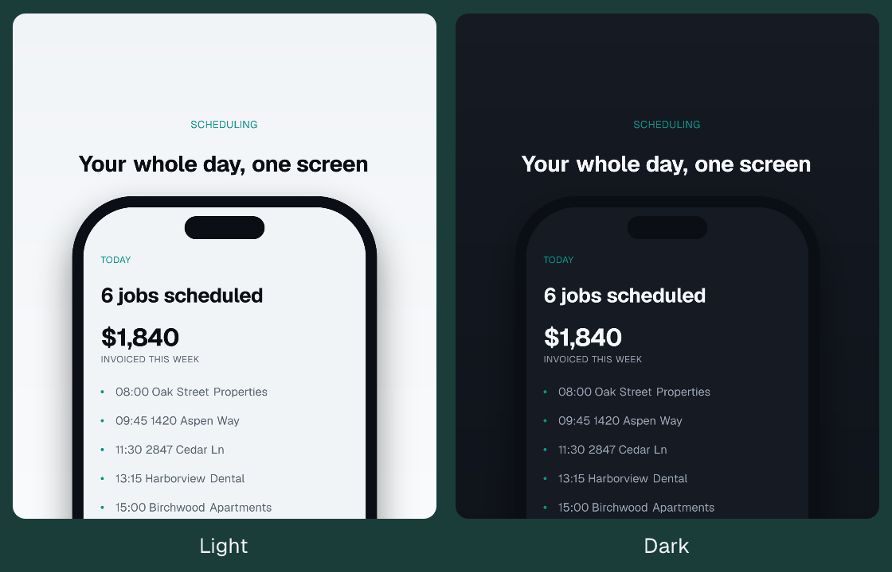
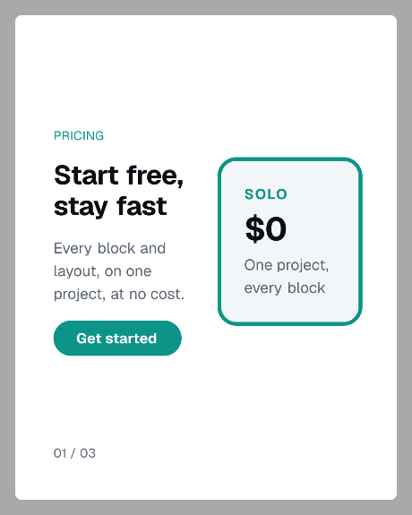

<h3 align="center">mediakit</h3>

<p align="center">
  <a href="https://www.npmjs.com/package/mediakit"></a>
  <a href="https://nodejs.org"></a>
  <a href="https://github.com/ado11231/mediakit/actions/workflows/ci.yml"></a>
  <a href="LICENSE"></a>
</p>

<p align="center">Render App Store screenshots, carousels, and social images from a JSON spec.</p>

## Screenshots

<p align="center">
  
</p>

`DeviceFrame` places an app screen inside a phone frame. `src` points at a capture, or at
another spec's render if the screen is built from blocks.

Use `chrome: "phone"` when the capture already contains a status bar. Use
`chrome: "phone-notch"` when it does not, which draws one.

## Carousels

<p align="center">
  
</p>

One spec with three frames renders `frame-01` through `frame-03`. The GIF above cycles the
three rendered frames.

The block, the layout, and the canvas size shown here are registered in a config file, not
built in.

## Install

```bash
npm i -D mediakit
npx mediakit init
npx mediakit render marketing/example.spec.json
```

Requires Node 22 or newer. mediakit makes no network calls at any point, including install.

## Project setup

Already have a design system? `mediakit init --from app/globals.css` reads your colours and
fonts and writes the config for you, marking every value it inferred with the token it came
from and every value it guessed with `GUESS`. Review it, then render.

`mediakit init` writes the two files a repo needs:

- `mediakit.config.ts` at the project root. It holds tokens and any custom blocks, layouts,
  and presets. The CLI also finds `.mts`, `.js`, and `.mjs` variants, and `--config <path>`
  selects a different file.
- A spec: a JSON file describing one asset set. Specs conventionally live in `marketing/`.

Paths inside a spec, such as a `DeviceFrame` `src`, resolve against the directory the command
runs from. Font paths in a config should be absolute (build them from `import.meta.dirname`).
A font is bundled, so the first render needs no font setup.

Output is written to `marketing/<spec-id>/frame-NN.png`, nested under the preset name when a
spec lists more than one. Rendered PNGs are intended to be committed: renders are
byte-identical, so a changed PNG in a pull request is a real change.

## How it works

A spec names one or more presets (the canvas sizes) and a list of frames. A frame names a
layout and the blocks that fill it. `render` reads the config for tokens, resolves every name
against a registry, and writes one PNG per frame.

```json
{
  "id": "store",
  "preset": ["ios-6.9", "play-phone"],
  "frames": [
    {
      "layout": "centered",
      "blocks": [
        { "type": "Background", "props": { "color": "surface" } },
        { "type": "Headline", "props": { "text": "Your whole day, one screen" } },
        {
          "type": "DeviceFrame",
          "props": { "chrome": "phone-notch", "src": "captures/today.png" }
        }
      ]
    }
  ]
}
```

## Commands

|           |                                                        |
| --------- | ------------------------------------------------------ |
| `init`    | write a config and an example spec                     |
| `presets` | list every size, with its dimensions and store rules   |
| `schema`  | print the spec vocabulary, for an LLM or a human       |
| `render`  | render a spec to PNGs, once per preset it names        |
| `preview` | serve rendered output locally, re-rendering on edit    |
| `check`   | validate specs, text, and images against store rules   |
| `export`  | write an upload-ready folder, verified before it lands |

`export` produces the folder you drag into App Store Connect or the Play Console: one directory
per preset, frames named so the upload order follows the filename sort, and a `manifest.json`
with a SHA-256 per frame and the constraints that were checked. Every rule runs before anything
is written, so a bundle that exists is a bundle that passed.

```bash
npx mediakit export marketing/store.spec.json
# export/store/ios-6.9/store-01.png, store-02.png, manifest.json
```

`check` also catches text your fonts cannot draw. An emoji or a CJK character with no glyph in
the loaded font renders as a blank or a tofu box, and nothing else in the pipeline notices, so
`check` reads the font's `cmap` and reports the exact codepoint.

`schema` prints what a valid spec may contain, built from your own registrations. Hand
`mediakit schema` to a model as a JSON Schema for structured output, or `mediakit schema
--format md` into a prompt, and it can author specs using your custom blocks without you
maintaining a catalog by hand.

`presets` works before you have a config, so you can see what mediakit renders without setting
anything up.

`check` also runs against images you already have:

```bash
npx mediakit check ./screenshots --preset ios-6.9
```

`--config <path>` points any command at a different config file.

## Sizes

App Store and Play: `ios-6.9` `ios-6.5` `ipad-13` `play-phone` `play-feature`
Social: `ig-portrait` `ig-square` `story` `li-portrait`
Web: `github-social` `producthunt-gallery` `cws-screenshot` `cws-marquee`

Each is checked against that channel's published rules: exact pixels, frame counts, alpha
channel. Additional sizes are registered in the config.

## Config

```ts
export default defineConfig({
  tokens: { color: { accent: '#0D9488' } },
  blocks: { PricingCard },
  layouts: { 'pricing-split': pricingSplit },
  presets: { 'preview-card': { width: 1080, height: 1350, renderer: 'still', scale: 2.5 } },
});
```

Only `color.accent` is required. Blocks read tokens, so changing a token changes every frame
that uses it.

## Determinism

Two renders of the same spec produce byte-identical PNGs, on macOS and Linux. Every preset
has a test asserting it.

## Docs

| file           |                                              |
| -------------- | -------------------------------------------- |
| `design.md`    | how it works and why it is built this way    |
| `roadmap.md`   | what is done, what is next                   |
| `CHANGELOG.md` | breaking changes, each with a migration line |

Pre-1.0, so breaking changes ship as minor versions.

## License

MIT. Video rendering is a separate opt-in package; nothing here pulls it in.
