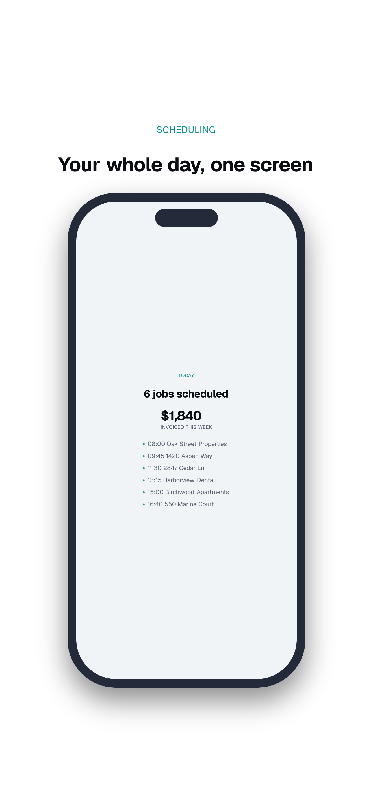
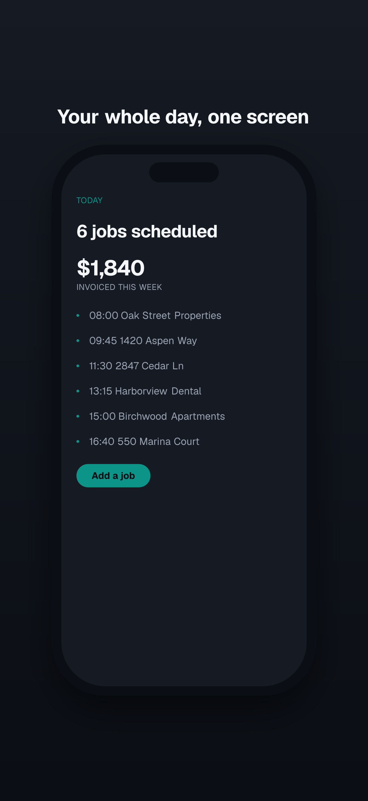
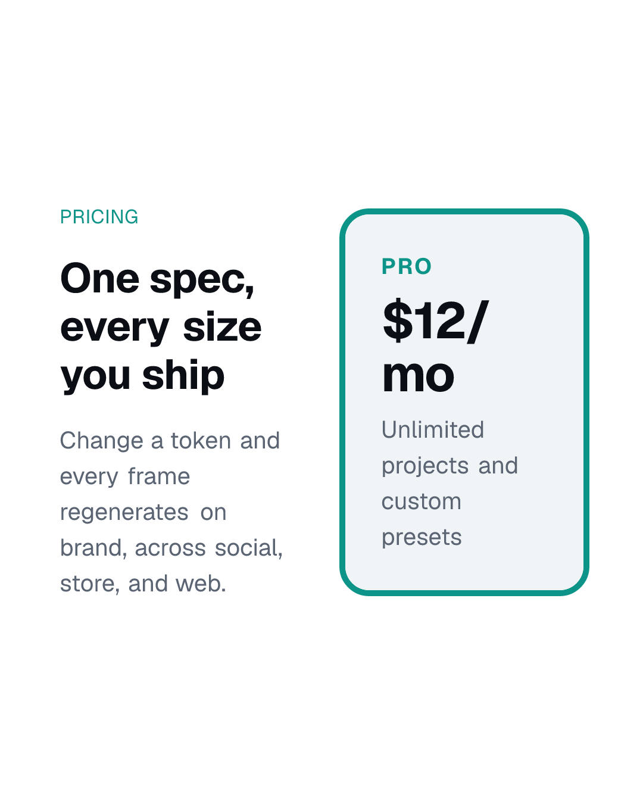
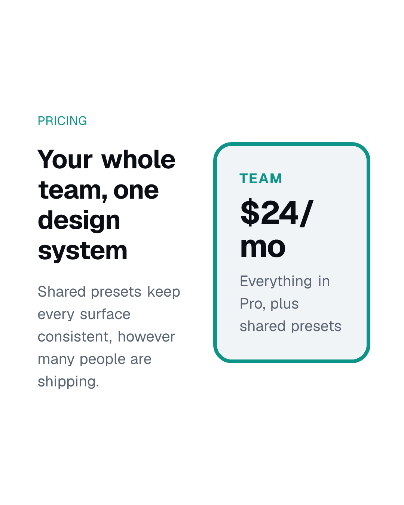

<h3 align="center">mediakit</h3>

<p align="center">
  <a href="https://www.npmjs.com/package/mediakit"></a>
  <a href="https://nodejs.org"></a>
  <a href="https://github.com/ado11231/mediakit/actions/workflows/ci.yml"></a>
  <a href="LICENSE"></a>
</p>

<p align="center"><b>App Store screenshots that build like code.</b></p>

<p align="center">
  One spec plus your design tokens, one command, every size a store asks for.
  Rendered in CI, reviewed in a pull request, never opened in a design tool.
</p>

```bash
npm i -D mediakit
npx mediakit init
npx mediakit render marketing/example.spec.json
```

Needs Node 22 or newer. Nothing is ever sent anywhere, at any point, including install.

## App Store Screenshots

<p align="center">
  
  &nbsp;&nbsp;&nbsp;&nbsp;&nbsp;&nbsp;
  
</p>

Same blocks, same layout, same copy. The two differ only in the colour tokens they are
handed, so a second theme is a config file rather than a second set of images to keep in
sync.

You bring the screen, mediakit does the rest: the device frame, the headline, the sizing,
and the checks. There are two ways to get the screen.

**Use a real screenshot.** Take it however you already do, from a simulator, a test run,
or by hand, and point at the file.

```json
{ "type": "DeviceFrame", "props": { "chrome": "phone", "src": "captures/today.png" } }
```

**Or build the screen out of blocks,** from the same tokens as your app. No simulator, no
backend, nothing to capture.

```json
{ "type": "DeviceFrame", "props": { "chrome": "phone-notch", "src": "marketing/screen.png" } }
```

They use different frames because a real screenshot already has a status bar and a Dynamic
Island in it. `phone` leaves room for them, `phone-notch` draws them.

> If you seed a database to take screenshots, give it its own account. A test account is
> full of things that look fine in a test and terrible in a listing: `(Test User)` name
> suffixes and dashboards reading `$0`.

## Stills and Carousels

<p align="center">
  
  &nbsp;&nbsp;
  
  &nbsp;&nbsp;
  
</p>

The same blocks and tokens make social posts, so a launch announcement is another spec
rather than another tool. Those three are one spec: a frame per slide, rendered to
`frame-01`, `frame-02`, `frame-03`, which is a carousel. They use a block, a layout, and a
canvas size that are not built in; all three came from a config file, which is how anything
mediakit does not ship gets added.

## Commands

|           |                                                    |
| --------- | -------------------------------------------------- |
| `init`    | write a config and a first spec that renders as-is |
| `render`  | render a spec, once per size it asks for           |
| `preview` | a local page that re-renders as you edit           |
| `check`   | catch what a store would reject, before you upload |

`check` works on its own, so you can point it at screenshots you already made:

```bash
npx mediakit check ./screenshots --preset ios-6.9
```

Add `--config <path>` to any of them to keep several configs, say a light one and a dark
one, in a single folder.

## Sizes

App Store and Play: `ios-6.9` `ios-6.5` `ipad-13` `play-phone` `play-feature`
Social: `ig-portrait` `ig-square` `story` `li-portrait`
Web: `github-social` `producthunt-gallery` `cws-screenshot` `cws-marquee`

Each is checked against that channel's published rules: exact sizes, image counts, and
whether an alpha channel gets you rejected. A size mediakit does not ship is a few lines in
your config, not a fork.

## Your Design System

mediakit will not make you retype your brand. Point it at the tokens you already have.

```ts
export default defineConfig({
  tokens: { color: { accent: '#0D9488' } },
  blocks: { PricingCard },
  layouts: { 'pricing-split': pricingSplit },
  presets: { 'preview-card': { width: 1080, height: 1350, renderer: 'still', scale: 2.5 } },
});
```

Only `color.accent` is required and a font comes bundled, so `init` renders on the first
run.

## Same Input, Same Pixels

Render twice and the files are identical, byte for byte, on macOS and Linux. That is what
makes an image reviewable in a pull request: when one changes, something really changed.
Every size is tested for it.

## Docs

| file           |                                              |
| -------------- | -------------------------------------------- |
| `design.md`    | how it works and why it is built this way    |
| `roadmap.md`   | what is done, what is next                   |
| `CHANGELOG.md` | breaking changes, each with a migration line |

Pre-1.0, so breaking changes come as minor versions.

## License

MIT. Video rendering is a separate opt-in package; nothing here pulls it in.
