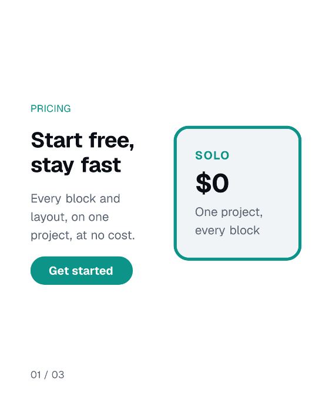

<h3 align="center">mediakit</h3>

<p align="center">
  <a href="https://www.npmjs.com/package/mediakit"></a>
  <a href="https://nodejs.org"></a>
  <a href="https://github.com/ado11231/mediakit/actions/workflows/ci.yml"></a>
  <a href="LICENSE"></a>
</p>

<p align="center"><b>App Store screenshots that build like code.</b></p>

<p align="center">
  One spec, one command, every size a store asks for.<br>
  Rendered in CI, reviewed in a pull request, never opened in a design tool.
</p>

```bash
npm i -D mediakit
npx mediakit init
npx mediakit render marketing/example.spec.json
```

Node 22 or newer. Zero network calls, ever, including install.

## App Store Screenshots

<p align="center">
  
</p>

Same spec, same blocks, same copy. Only the color tokens differ, so the second theme is a config file, not a second set of images.

You bring the screen. mediakit adds the frame, the headline, the sizing, and the checks.

Point at a real screenshot:

```json
{ "type": "DeviceFrame", "props": { "chrome": "phone", "src": "captures/today.png" } }
```

Or build the screen from blocks, no simulator, nothing to capture:

```json
{ "type": "DeviceFrame", "props": { "chrome": "phone-notch", "src": "marketing/screen.png" } }
```

`phone` leaves room for the status bar a capture already has. `phone-notch` draws one.

> Seeding a database for screenshots? Give it its own account. `(Test User)` names and `$0` dashboards look fine in a test and terrible in a listing.

## Carousels

<p align="center">
  <picture>
    <source media="(prefers-color-scheme: dark)" srcset="docs/assets/launch-dark.gif">
    
  </picture>
</p>

Three frames, one spec, rendered to `frame-01` through `frame-03`. A README cannot swipe, so this one loops.

The block, the layout, and the canvas size above are not built in. All three come from a config file, which is how anything mediakit does not ship gets added.

## Commands

|           |                                                    |
| --------- | -------------------------------------------------- |
| `init`    | write a config and a first spec that renders as-is |
| `render`  | render a spec, once per size it asks for           |
| `preview` | a local page that re-renders as you edit           |
| `check`   | catch what a store would reject, before you upload |

`check` also works on screenshots you already have:

```bash
npx mediakit check ./screenshots --preset ios-6.9
```

Add `--config <path>` to any command to keep several configs, say a light and a dark one, in one folder.

## Sizes

App Store and Play: `ios-6.9` `ios-6.5` `ipad-13` `play-phone` `play-feature`
Social: `ig-portrait` `ig-square` `story` `li-portrait`
Web: `github-social` `producthunt-gallery` `cws-screenshot` `cws-marquee`

Each is checked against that channel's published rules: exact pixels, frame counts, alpha channel. A size mediakit does not ship is a few lines of config, not a fork.

## Your Design System

Point mediakit at the tokens you already have. It will not make you retype your brand.

```ts
export default defineConfig({
  tokens: { color: { accent: '#0D9488' } },
  blocks: { PricingCard },
  layouts: { 'pricing-split': pricingSplit },
  presets: { 'preview-card': { width: 1080, height: 1350, renderer: 'still', scale: 2.5 } },
});
```

Only `color.accent` is required. A font comes bundled, so `init` renders on the first run.

## Same Input, Same Pixels

Render twice and the files are byte-identical, on macOS and Linux. When a PNG changes in a pull request, something really changed. Every size is tested for it.

## Docs

| file           |                                              |
| -------------- | -------------------------------------------- |
| `design.md`    | how it works and why it is built this way    |
| `roadmap.md`   | what is done, what is next                   |
| `CHANGELOG.md` | breaking changes, each with a migration line |

Pre-1.0, so breaking changes come as minor versions.

## License

MIT. Video rendering is a separate opt-in package; nothing here pulls it in.
