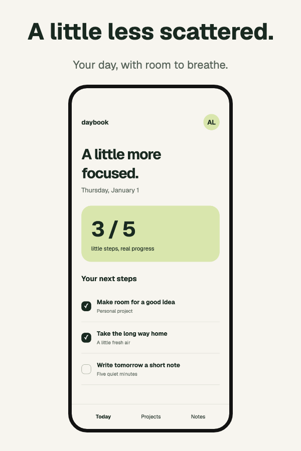
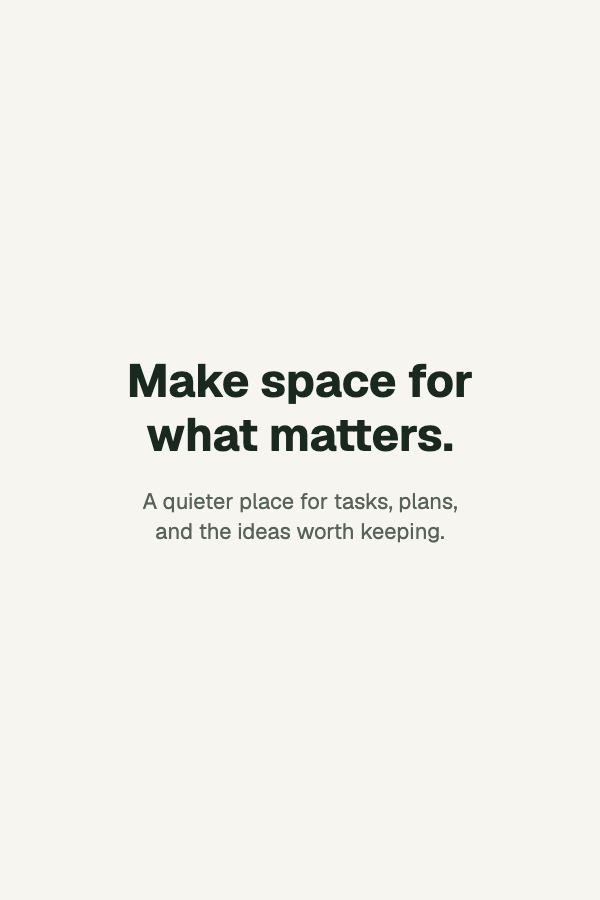

<h3 align="center">mediakit</h3>

<p align="center">
  <a href="https://www.npmjs.com/package/mediakit"></a>
  <a href="https://nodejs.org"></a>
  <a href="https://github.com/ado11231/mediakit/actions/workflows/ci.yml"></a>
</p>

<p align="center">Real app screenshots and carousels, made with code.</p>

<br>

<p align="center">
  
  &nbsp;&nbsp;
  
</p>

<p align="center"><sub>One campaign, the app's design tokens, and a few commands.</sub></p>

<br>

Write your messages, choose screens and destinations, then preview and export. Mediakit captures
real app UI with sample data and composes it with your fonts, colors, and phone frames.
Missing design values are reported, never guessed.

## Start

```bash
npm install -D mediakit
npx mediakit init
```

`init` discovers CSS and theme files, lists fonts, installs Chromium when needed, and scaffolds
an unfinished design configuration. Map the values you want to use and supply the required
font files and text styles. Existing configuration and copy are preserved.

```bash
npx mediakit check
npx mediakit preview
npx mediakit export
```

Preview shows the rendered PNGs. Export writes ordered images or a multipage PDF, checking
fonts, text overflow, source resolution, and output dimensions before replacing the previous
successful bundle.

## Write the campaign

```ts
import { defineCampaign } from 'mediakit';

export default defineCampaign({
  id: 'launch',
  outputs: ['instagram-portrait', 'app-store-iphone'],
  slides: [
    {
      layout: 'headline-above-device',
      headline: 'Your day, with room to breathe.',
      body: 'Tasks, notes, and the next little step.',
      screen: 'dashboard',
      fixture: 'default',
      device: 'iphone',
    },
  ],
});
```

Use `text-only` for copy without a screenshot, or `text-beside-device` for a side-by-side layout.
Configure fonts, typography, and spacing once; override them per destination or slide when needed.
Exact position boxes, 2D rotation, explicit crops, and black or silver bezels are supported.

## Use your design

`globals.css`, imported CSS variables, Tailwind theme declarations, and exported JS/TS token
objects can supply explicitly mapped values. Changes to those values appear on the next run.
Fonts must reference actual local files and every weight used by the campaign.

A missing requirement blocks that output in preview and blocks the entire export. You can still
initialize the project, edit copy, and use the diagnostics page.

[Configuration and sizing](docs/configuration.md) · [Fixture setup](docs/fixtures.md)

## Destinations

| Preset               | Output                          |
| -------------------- | ------------------------------- |
| `instagram-portrait` | 1080 × 1350 PNGs                |
| `instagram-square`   | 1080 × 1080 PNGs                |
| `instagram-story`    | 1080 × 1920 PNGs                |
| `linkedin-document`  | 1080 × 1350 document pages, PDF |
| `app-store-iphone`   | 1320 × 2868 PNGs                |
| `app-store-ipad`     | 2064 × 2752 PNGs                |
| `google-play-phone`  | 1080 × 1920 PNGs                |

Custom dimensions and PDF outputs go in your config. Each destination renders independently;
text never silently shrinks to fit.

## Real screens, sample data

Web capture uses a local fixture entry and blocks API calls and WebSockets. Expo iOS capture
uses a separate fixture build, Xcode's simulator, and Maestro. Both reuse your screen components
with sample props or providers. Production database clients must stay outside the fixture entry.
Supplied screenshots also work, including for platforms without a capture adapter.

[Web example](examples/source-app) · [Expo integration example](examples/expo-fixtures)

Chromium is a separate download. iOS setup is a one-time platform requirement; Android capture
is not included yet. Rendering is reproducible in a pinned environment, not across arbitrary
browser, OS, or simulator versions. No telemetry or watermarks.

This branch introduces the breaking 0.2 API. [Migration notes](docs/migration.md).

MIT.
